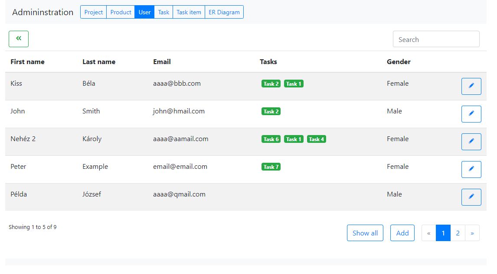
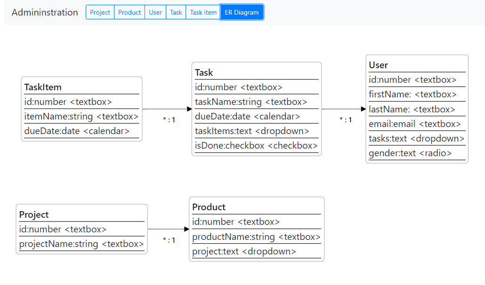

# Angular 7 - Dynamic Reactive Forms directly from TypeORM models

This project demonstartes how to generate Angular7+ dynamic reactive forms and CRUD tables, directly from [typeORM](http://typeorm.io) models.

## Creates tables and reactive forms for data handing

## Automatic ER diagram

## Prerequistences

- mySQL server

## Installation steps

- clone repository
- ``npm install``
- Check ormconfig.json and set your DB connections details
- Run db migration ``.\node_modules\\.bin\typeorm migration:run``
- Build crud-table-lib library: ``ng build crud-table-lib``
- start client: ``npm run start``
- start backend: ``npm run gulp backend``

